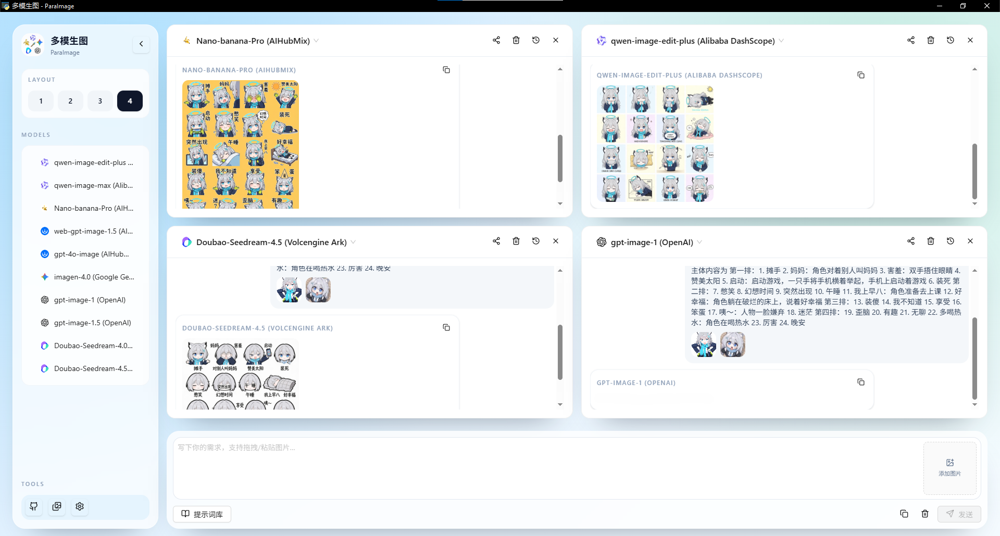

# ParaImage多模生图（生图抽卡机）

<div align="center">


*ParaImage：1 Prompt，4 Models，4 Luckies！.*

**中文 | [English](README_EN.md)**


<b>一个集合了nano banana pro🍌和众多国产优秀生图大模型（qwen,豆包）的AI生图应用，生成图片不会附带ai生成水印字样，支持抠图，可以用于生成2d素材<br></b>
<b> 最多支持四个模型同时发力</b>

<b>🎯 打破单模型生图的 “赌运气” 困境 ——1 个提示词 = 4 个顶级 AI 模型同步发力，一次生成 4 张风格迥异的优质图片，像抽卡一样兼具 “确定性高效” 与 “随机性惊喜”：既不用反复调整提示词试错，又能从多模型成果中挑最优解，还可能解锁意外契合需求的 “隐藏款” 生图，让 AI 创作从 “单点博弈” 变成 “批量开挂”。</b>

<br>

*如果该项目对你有用, 欢迎star🌟 &  fork🍴*

<br>

</div>

## 应用截图



## 功能亮点
- 多模型并行生图，统一配置入口
- 提示词库（内置默认模板，支持导入/导出）
- 参考图支持：拖拽/粘贴/上传图片
- 图片后处理：抠图、网格切分
- 历史记录与图片管理
- 更新检查与自动安装（GitHub Release）

## 支持的模型与供应商
- [Volcengine Ark 火山引擎](https://www.volcengine.com/activity/ark)
- OpenAI
- Google Gemini
- [Alibaba DashScope 阿里云百炼](https://bailian.console.aliyun.com/cn-beijing/?spm=5176.29597918.J_SEsSjsNv72yRuRFS2VknO.2.55ba7b08ULdjxL&tab=home#/home)
- [AIHubMix 推理时代](https://aihubmix.com/)

其中火山阿里云百炼新人注册送token!

## 技术栈
- 前端：React + Vite + Tailwind CSS + Ant Design + Lucide
- 后端：Python + PyWebView + Peewee + SQLite + Pillow + rembg + Pydantic

## 本地开发

### 环境要求
- Node.js 20+
- Python 3.12+
- uv（Python 包管理）

### 启动前端
```bash
cd frontend
npm ci
npm run dev
```

### 启动桌面应用（开发模式）
```bash
cd backend
uv venv .venv
uv sync --frozen
DEBUG=true uv run python src/main.py
```

## 打包发布
```bash
cd frontend
npm ci
npm run build

cd ..
uv run --project backend python scripts/build_package.py
```

打包产物默认输出到 `dist/`。

## 目录结构
- `frontend/` 前端代码
- `backend/` 后端代码
- `scripts/` 打包脚本
- `prompt-library.json` 默认提示词库
